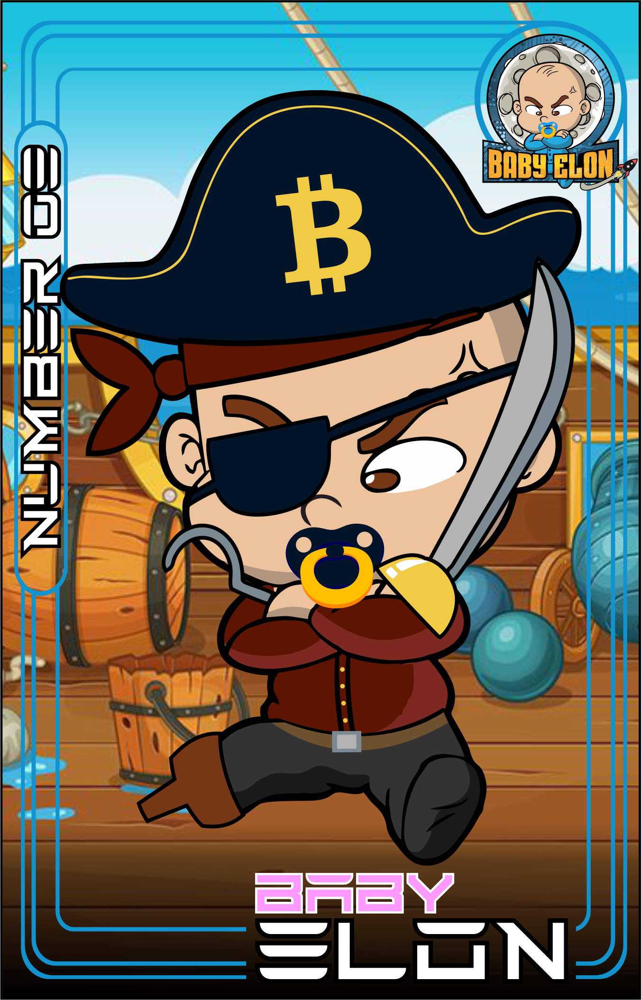

# 🗣 BabyElonSwap

:tada:At BabyElonSwap, we will revolutionize the meme coin category, where we will obviously have a fully organic community, and benefit our investors, with safety and yield first! Our $BES token is hyper deflationary, and designed to become increasingly scarce, thereby increasing its value. We also have a self-reflecting system, in which all holders will receive 11% of every chain transaction that takes place in our BabyElonSwap ecosystem, where it will be fully reverted to our investors.

:tada: Baby Elon ($BES) is a hyper-deflationary cryptocurrency token, on the Binance Smart Chain (BSC), which investor pays holders, and a spectacular 15% on Binance USA Dollars (BUSD) a stable currency that is pegged 1:1 to the US dollar. This 15% reward is applied to all purchases, sales and transactions, distributing wealth consistently.\
\
:tada: BabyElonSwap is structured to operate and function as a business, and not as someone's someone's hobby or sidehutle. This means that the main function of the core team is to gather and use talent when and as needed, for the most efficient cost, in the shortest time possible, achieve the best TCO and ROI. To be frank, BabyElonSwap is here to make money for its investors and for itself.\

         
